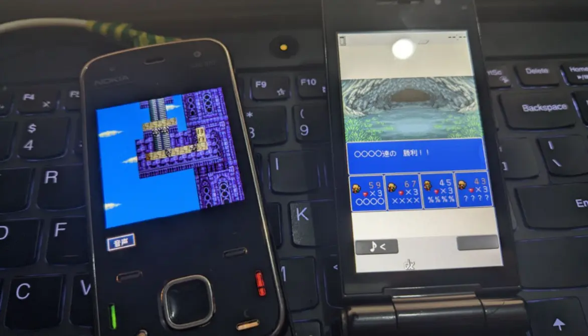

# Makai Toushi Sa·Ga Wrapper

A MIDP wrapper for the DoJa platform game **魔界塔士サ・ガ**.

## How to Use?

You only need [Apache Ant](https://ant.apache.org/bindownload.cgi)!

1. Put the DoJa version JAR/SP/JAM into `games/`;
2. Run `ant`;
3. The MIDP version of Sa·Ga will be output to `dist/` :)

## What devices can play?

JVM Heap ≥ 6144 KB... I guess...

At least it runs perfectly on the N86, with zero palette issues.

## How to Add Translations?
It's very straightforward!
Just run the **ant** build once, and Translation.tsv will be generated under `comp/translation` for you to translate.

You can safely ignore Index.tsv, its only used internally to index the translations.

## The Code Is Messy!

Yes, I used ChatGPT.

I sincerely apologize for the code cleanliness.

## Test!

Test video: [Youtube](https://www.youtube.com/watch?v=XI0uCMRBXlw&t)

- KEmulator: Untested, perfect?
- KEmulator nnmod: MMAPI seems to clash with the JVM's Java Sound sync, See Common.
- FreeJ2ME-Plus: Basically perfect.
- J2ME-Loader: Basically perfect.
- Real device: Basically perfect, but if you play this game without any speed-up, it will take at least 50 hours.
- Common: J2ME emulators on native JRE easily deadlock with frequent WAV playback.

## Modules?

- [MLD Player](https://github.com/Magstic/MLD_Player) — MLD to MID/WAV conversion.
- [DoJa to MIDP Core](https://github.com/Magstic/DoJa-to-MIDP-Core) — Core runtime and tools.
- [ProGuard 6.0.3](https://mvnrepository.com/artifact/com.guardsquare/proguard-base) — Game obfuscation and preverification.
- [CLDC API 1.1](https://mvnrepository.com/artifact/javax.microedition/cldc) — Basic CLDC API support.
- [MIDP API 2.0](https://mvnrepository.com/artifact/javax.microedition/midp) — Basic MIDP API support.

## Thanks!

[Keitai Wiki](https://keitaiwiki.com/wiki/KeitaiWiki)

[Fusion Pixel Font](https://github.com/TakWolf/fusion-pixel-font)